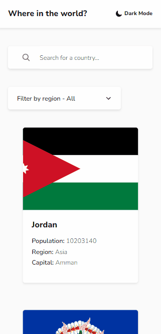

# Frontend Mentor - REST Countries API with color theme switcher solution

This is a solution to the [REST Countries API with color theme switcher challenge on Frontend Mentor](https://www.frontendmentor.io/challenges/rest-countries-api-with-color-theme-switcher-5cacc469fec04111f7b848ca). Frontend Mentor challenges help you improve your coding skills by building realistic projects. 

## Table of contents

- [Overview](#overview)
  - [Screenshot](#screenshot)
- [My process](#my-process)
  - [Built with](#built-with)
  - [What I learned](#what-i-learned)

## Overview

### Screenshot

#### Mobile

#### Desktop

## My process

### Built with

- [React](https://reactjs.org/) - JS library
- [React Router](https://reactrouter.com/en/main) - JS library
- [Prop Types](https://www.npmjs.com/package/prop-types) - JS library
- [Styled Components](https://styled-components.com/) - For styles

### What I learned

- Used styled components theming to change colors to light or dark mode
  - save the chosen theme in local storage
- Applied Skeleton Screen to improve the user experience when loading images
- Created component Loader when fetch data in API
- Created Hook useLocalStorage to save and get values in Local Storage
- Created page 404 not found
- Created a visual alert if an error occurs when fetching data from the API
- Created the Service layer to fetch country data in API [REST Countries](https://restcountries.com/)
- Created country mapper to facilitate data manipulation
- Used Eslint for source code standardization

